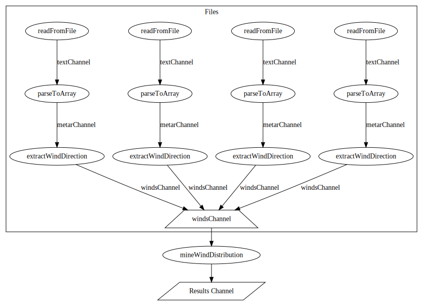

# METAR Wind Direction Analyzer

## Introduction
This Go program is designed to analyze wind direction distribution in METAR reports. It reads METAR files, extracts wind direction data, and calculates the distribution of wind directions. The program utilizes goroutines for concurrent processing, making it efficient for handling multiple METAR files simultaneously.

## Execution Flow Visualization
For an overview of the program's execution flow, refer to the following visualization (In this diagram, it is assumed that there are four files to analyze):

